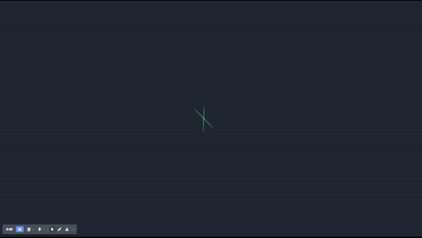

# Frontend Mentor - Advice generator app solution

This is a solution to the [Advice generator app challenge on Frontend Mentor](https://www.frontendmentor.io/challenges/advice-generator-app-QdUG-13db). Frontend Mentor challenges help you improve your coding skills by building realistic projects.

## Table of contents

- [Overview](#overview)
  - [The challenge](#the-challenge)
  - [Screenshot](#screenshot)
  - [Links](#links)
- [My process](#my-process)
  - [Built with](#built-with)
  - [What I learned](#what-i-learned)
- [Author](#author)

## Overview

### The challenge

Users should be able to:

- Upon entering the site see a loading screen for a clean user experience
- View the optimal layout for the app depending on their device's screen size
- See hover states for all interactive elements on the page
- Generate a new piece of advice by clicking the dice icon

### Screenshot

### Links

- [Live Site](https://6451828d06603a1f3fb91ef4--precious-dusk-9e7856.netlify.app/)
- Live Site URL: [Add live site URL here](https://your-live-site-url.com)

## My process

### Built with

- Semantic HTML5 markup
- CSS custom properties
- Flexbox
- Mobile-first workflow
- [Vue3](https://vuejs.org/) - JS library
- npm package: [VueJS Spinner](https://www.npmjs.com/package/vue-spinner)

### What I learned

This was great practice to get me more acquainted with VueJS and working with APIs. It was simple and I would like to try more challenging APIs. 

## Author

- Website - [Erine Natnat](https://www.linkedin.com/in/erinenatnat)
- Frontend Mentor - [@rinster](https://www.frontendmentor.io/profile/rinster)
- Twitter - [@rinster](https://www.twitter.com/rinster)

